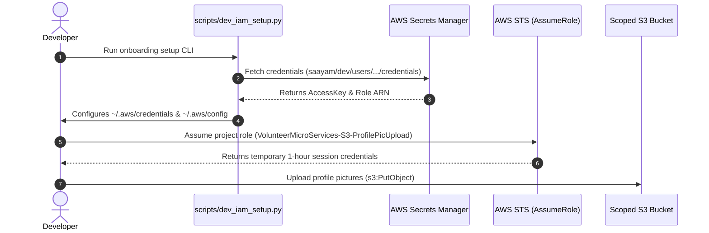

# Saayam DevSecOps - Developer IAM & Role Onboarding Guide

## 1. Overview & Security Architecture

To maintain high security and least-privilege access across Saayam microservices (such as the Volunteer, Request, and Notification services), **developers do not receive direct write/read permissions on cloud resources**.

Instead, developers use the **AWS AssumeRole pattern**:
1. You are assigned a unique developer IAM User (e.g. `saayam-dev-volunteer-dev`).
2. Your user credentials (access key / secret key) are securely stored and retrieved from **AWS Secrets Manager**.
3. Your user has permission **only** to call `sts:AssumeRole` on your specific project role (e.g. `VolunteerMicroServices-S3-ProfilePicUpload-dev`) and read your own secret.
4. When executing code or CLI commands, temporary 1-to-12-hour session credentials with scoped permissions (e.g. S3 profile picture upload) are generated automatically.



---

## 2. Quick Start: Automated Setup (Recommended)

### Step 1: Install Dependencies
```bash
pip install -r scripts/requirements.txt
```

### Step 2: Run Setup CLI
Run the onboarding CLI with your assigned developer username:
```bash
python scripts/dev_iam_setup.py --username volunteer-dev --configure-aws-cli --test-access
```

What this command does:
- Fetches your access keys and target project role ARN from AWS Secrets Manager.
- Configures your base profile in `~/.aws/credentials` (`[saayam-dev-volunteer-dev-base]`).
- Configures your assumed-role profile in `~/.aws/config` (`[profile saayam-dev-volunteer-dev]`).
- Performs an automated live STS `AssumeRole` test and validates scoped S3 permissions.

---

## 3. Manual AWS CLI Setup

If you prefer to configure your local environment manually:

### 1. Configure Base Profile in `~/.aws/credentials`
```ini
[saayam-dev-volunteer-dev-base]
aws_access_key_id = AKIA...YOUR_DEV_KEY...
aws_secret_access_key = ...YOUR_SECRET_KEY...
```

### 2. Configure Assumed Role in `~/.aws/config`
```ini
[profile saayam-dev-volunteer-dev]
role_arn = arn:aws:iam::123456789012:role/saayam/roles/VolunteerMicroServices-S3-ProfilePicUpload-dev
source_profile = saayam-dev-volunteer-dev-base
region = us-east-1
output = json
```

### 3. Verify Identity
```bash
export AWS_PROFILE=saayam-dev-volunteer-dev
aws sts get-caller-identity
```

Output should show the assumed role session:
```json
{
    "UserId": "AROA...:botocore-session-...",
    "Account": "123456789012",
    "Arn": "arn:aws:sts::123456789012:assumed-role/VolunteerMicroServices-S3-ProfilePicUpload-dev/..."
}
```

---

## 4. Using the Assumed Role in Application Code

### Python (Boto3)
When using Boto3, simply specify the profile name or set `AWS_PROFILE`:
```python
import boto3

# Method 1: Using session with named profile
session = boto3.Session(profile_name="saayam-dev-volunteer-dev")
s3 = session.client("s3")

# Upload a volunteer profile picture
s3.upload_file(
    Filename="local_pic.png",
    Bucket="saayam-dev-volunteer-media",
    Key="profile-pics/volunteer-123.png"
)
print("Profile picture uploaded successfully!")
```

### Node.js / TypeScript (@aws-sdk)
```typescript
import { S3Client, PutObjectCommand } from "@aws-sdk/client-s3";
import { fromIni } from "@aws-sdk/credential-providers";

const s3Client = new S3Client({
  region: "us-east-1",
  credentials: fromIni({ profile: "saayam-dev-volunteer-dev" })
});

// Use s3Client as normal...
```

---

## 5. Provisioning New Developers with Terraform

DevSecOps engineers and team leads can provision new developers by updating `terraform/environments/dev/terraform.tfvars`:

```hcl
additional_developers = {
  "jane-doe" = {
    project_name   = "volunteer"
    email          = "jane.doe@saayam.org"
    role_purpose   = "s3-profile-pics"
    team           = "Volunteer-Backend"
    s3_bucket_arns = [
      "arn:aws:s3:::saayam-dev-volunteer-media",
      "arn:aws:s3:::saayam-virginia-private"
    ]
  }
}
```

Then run:
```bash
cd terraform/environments/dev
terraform plan -out=tfplan
terraform apply tfplan
```

Terraform will automatically:
1. Create the IAM user `saayam-dev-jane-doe`.
2. Generate an access key pair.
3. Store the credentials in AWS Secrets Manager at `saayam/dev/users/jane-doe/credentials`.
4. Create the scoped project role with restricted S3 permissions.
5. Attach the least-privilege user policy allowing only role assumption and secret retrieval.

---

## 6. Security Best Practices

- **Never Commit Secrets**: Do not commit AWS credentials or `.env` files with secret keys to Git.
- **Rotate Credentials**: Secrets should be rotated every 90 days. You can regenerate access keys via Terraform or Secrets Manager.
- **Principle of Least Privilege**: Project roles only grant permissions required for specific microservice workflows (e.g. `s3:PutObject` on `profile-pics/*`).
- **Short-Lived Tokens**: Always use role assumption sessions instead of raw IAM user credentials for development work.
