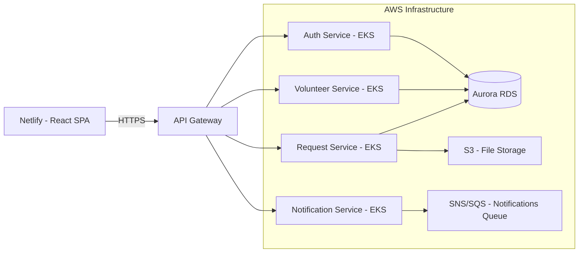
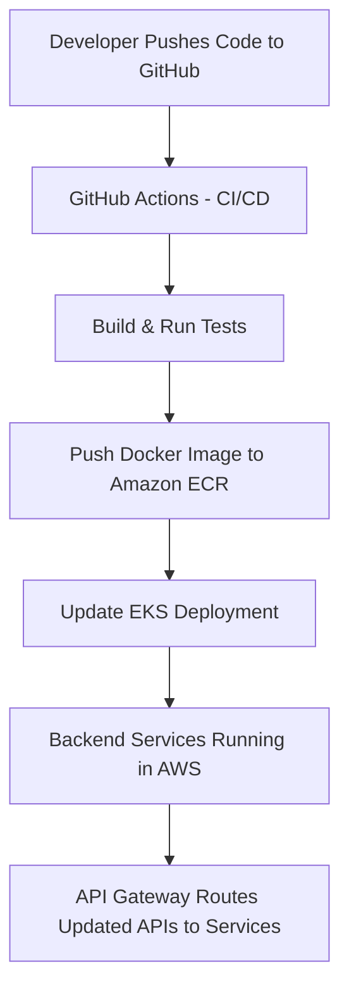

# Saayam Test Application – Architecture & Operational Flow (AWS/Backend-Focused)

**Version:** 1.0  
**Owners:** Engineer B (AWS/Backend Lead), Engineer A (UI Lead)  
**Scope:** This document focuses **only on backend architecture, AWS services, and infrastructure flows**. UI architecture and flows are documented separately by Engineer A.  

**Last Updated:** 2025-08-13  

---

## 1. Overview
The backend of the Saayam Test Application is hosted on **AWS** and exposes APIs to the UI via **API Gateway**. It handles authentication, request processing, notifications, donations, and data storage. The services run inside an **Amazon EKS (Kubernetes)** cluster for scalability and high availability.

This document covers:
- **AWS infrastructure**.
- **Backend service interactions**.
- **Deployment pipeline overview**.

---

## 2. High-Level Architecture (AWS Context)
> The backend portion is: **API Gateway → AWS Services (EKS, RDS, S3, SNS/SQS)**.

---

## 3. Dependencies & Environments

| Item           | Detail                                             |
|----------------|----------------------------------------------------|
| API Gateway    | Public entry point for all API requests            |
| Cluster        | Amazon EKS (multi-node, multi-AZ)                  |
| Database       | Amazon Aurora (PostgreSQL/MySQL compatible)        |
| Storage        | Amazon S3 for files, history data, and ML artifacts|
| Queue/Topics   | SNS/SQS for asynchronous notifications             |
| Monitoring     | Amazon CloudWatch                                  |
| Deployment     | GitHub Actions → ECR → EKS                         |

---

## 4. Backend ↔ External Touchpoints

| Integration Type   | Purpose                                        | Example Service          |
|--------------------|------------------------------------------------|--------------------------|
| Payment Gateway    | Handle donations securely                      | Razorpay/Stripe          |
| ML Model Service   | Provide AI/ML predictions or analytics         | AWS Sagemaker            |
| Email/SMS Service  | Send transactional notifications               | Amazon SES/SNS           |
| Auth Provider      | User authentication & JWT token issuance       | Cognito / Custom Service |

---

## 5. Deployment Flow

---

**Note:** AWS Infrastructure & Backend API details are documented separately by **Engineer B (AWS Lead)**.  
**UI architecture and flows** are documented separately by **Engineer A (UI Lead)**.
