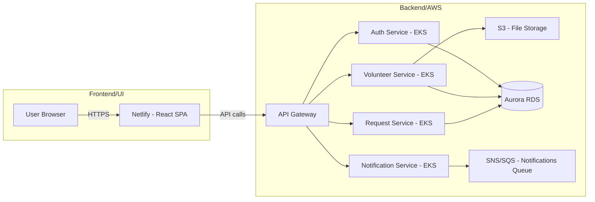
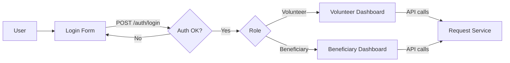
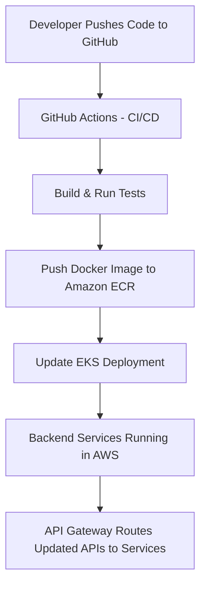

# Saayam Test Application – Full Architecture & Operational Flow

**Version:** 1.0  
**Owners:** Engineer A (UI Lead), Engineer B (AWS/Backend Lead)  
**Scope:** This document covers **UI architecture and flows** as well as **AWS backend architecture and infrastructure** for the Saayam Test Application.  

**Last Updated:** 2025-08-13  

---

## 1. Overview
The Saayam Test Application is composed of two main parts:  
1. **Frontend/UI** – A React single-page application (SPA) hosted on Netlify.  
2. **Backend** – AWS-hosted services, deployed via Amazon EKS (Kubernetes), exposing APIs via API Gateway.  

It supports volunteers and beneficiaries to create, manage, and fulfill help requests.  
This document covers:
- **UI flows**.
- **How the UI communicates with backend APIs**.
- **AWS infrastructure & backend services**.
- **Deployment considerations**.

---

## 2. High-Level Architecture (Combined View)

---

## 3. UI Dependencies & Environments

| Item           | Detail                                  |
|----------------|-----------------------------------------|
| Hosting        | Netlify (test environment)              |
| API Base URL   | https://<api-base>/v1                   |
| Auth Provider  | TBD (handled by backend)                |
| Auth Storage   | Access token in localStorage/session    |
| Roles          | Volunteer, Beneficiary                  |
| Env Vars Used  | VITE_API_URL, VITE_ENV                  |

---

## 4. Backend Dependencies & Environments

| Item           | Detail                                             |
|----------------|----------------------------------------------------|
| API Gateway    | Public entry point for all API requests            |
| Cluster        | Amazon EKS (multi-node, multi-AZ)                  |
| Database       | Amazon Aurora (PostgreSQL/MySQL compatible)        |
| Storage        | Amazon S3 for files, history data, and ML artifacts|
| Queue/Topics   | SNS/SQS for asynchronous notifications             |
| Monitoring     | Amazon CloudWatch                                  |
| Deployment     | GitHub Actions → ECR → EKS                         |

---

## 5. UI ↔ API Touchpoints

| UI Page/Flow         | Action                   | API Endpoint (example) |
|----------------------|--------------------------|-------------------------|
| Login                | Authenticate user        | POST /auth/login        |
| Volunteer Dashboard  | Fetch “My Requests”      | GET /requests?me        |
| Create Help Request  | Submit new request       | POST /requests          |
| Notifications        | Fetch latest updates     | GET /notifications      |
| Donate               | Process payment          | POST /donate            |

---

## 6. Backend ↔ External Touchpoints

| Integration Type   | Purpose                                        | Example Service          |
|--------------------|------------------------------------------------|--------------------------|
| Payment Gateway    | Handle donations securely                      | Razorpay/Stripe          |
| ML Model Service   | Provide AI/ML predictions or analytics         | AWS Sagemaker            |
| Email/SMS Service  | Send transactional notifications               | Amazon SES/SNS           |
| Auth Provider      | User authentication & JWT token issuance       | Cognito / Custom Service |

---

## 7. UI Flow: Login → Dashboard

---

## 8. Deployment Flow

---

**Note:**  
- AWS Infrastructure & Backend API details are documented and maintained by **Engineer B (AWS Lead)**.  
- UI architecture and flows are documented and maintained by **Engineer A (UI Lead)**.
